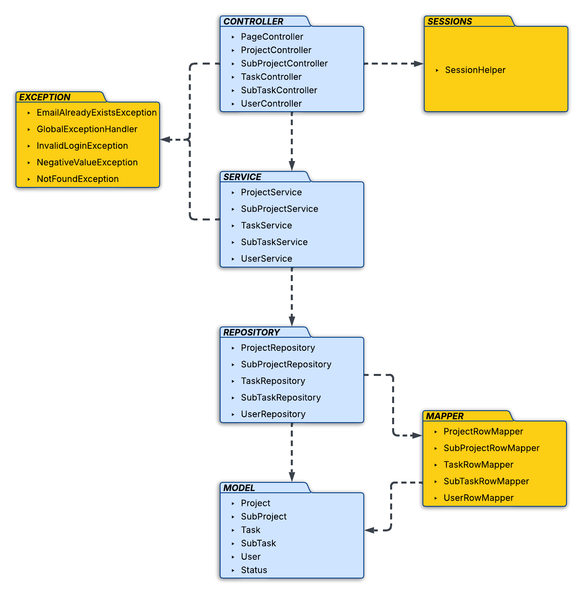
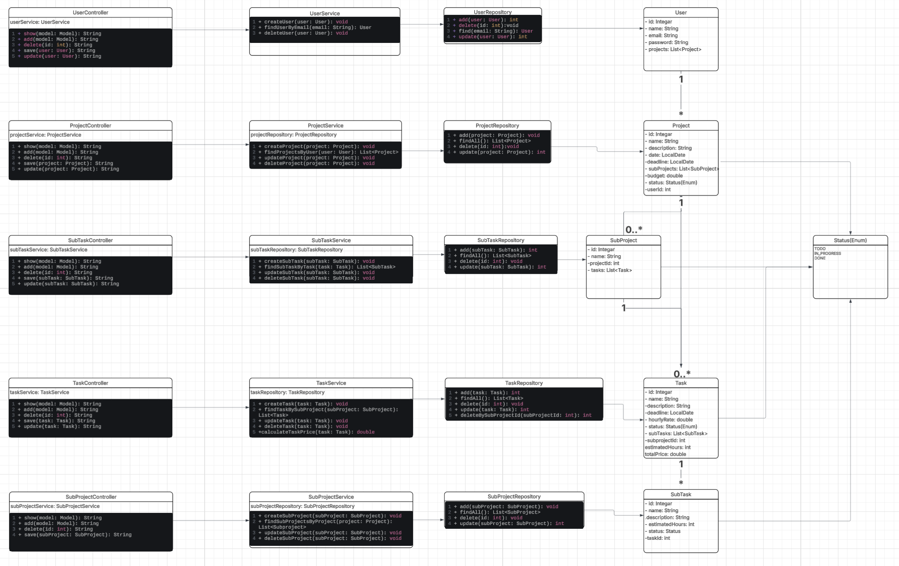
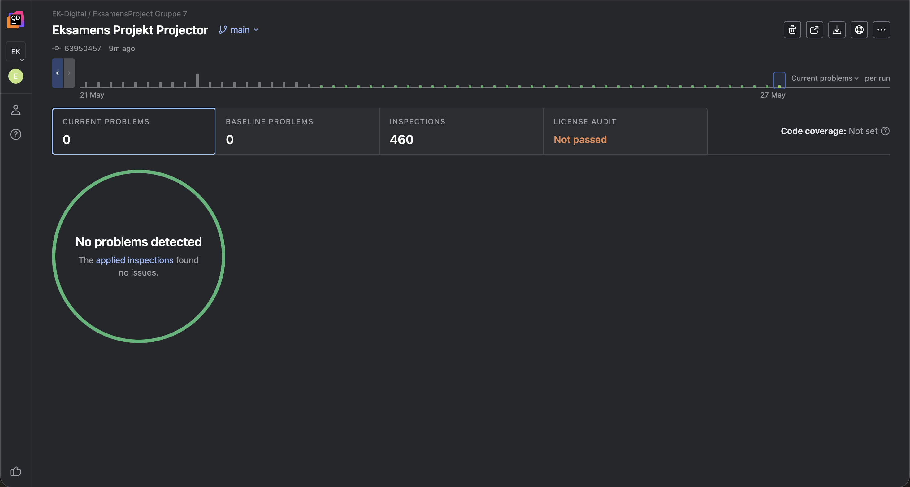

# Projector – Dokumentation

Dette repository indeholder dokumentation for **Projector**, som er en webapplikation til projektstyring.

Projector gør det muligt at oprette og administrere projekter, delprojekter, opgaver og underopgaver.  
Formålet er at give brugeren et bedre overblik over projektets struktur, deadlines, status og økonomi.

## Webapplikation

Projektet kan tilgås her:

[Åbn Projector webapplikation](https://projector-app-brfnhwhff3axbdg7.polandcentral-01.azurewebsites.net/)

## Funktioner

I applikationen kan brugeren blandt andet:

- oprette og logge ind som bruger
- oprette, redigere og slette projekter
- opdele projekter i delprojekter
- oprette opgaver og underopgaver
- angive deadline, budget, timepris og estimerede timer
- følge status på projekter, opgaver og underopgaver

## Projektstruktur

Systemet er bygget op omkring en bruger, som kan have flere projekter.  
Et projekt kan bestå af flere delprojekter, som igen kan indeholde flere opgaver.  
Opgaver kan opdeles i underopgaver, så arbejdet bliver mere overskueligt.

## Diagrammer

### ER-diagram

ER-diagrammet viser relationerne mellem systemets data.

### UML package diagram

UML package diagrammet viser projektets overordnede lag og struktur.

### Klassediagram

Klassediagrammet viser systemets centrale klasser, attributter, metoder og relationer.

## Qodana

Projektet er analyseret med Qodana for at finde mulige problemer i koden.

